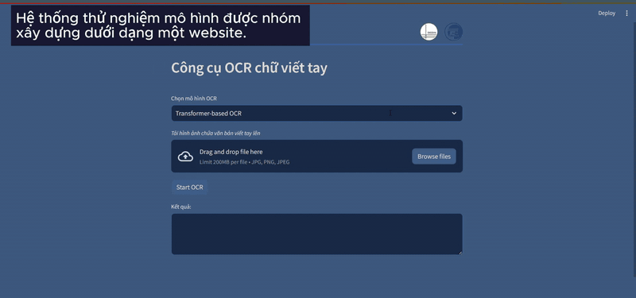

# Vietnamese Handwriting Recognition (OCR)

Machine Learning course project (Group 15, VNU-UET): recognising handwritten Vietnamese words with a CRNN baseline and two Transformer-based encoder–decoder models (TrOCR and MaskOCR).

**Authors:** Nguyễn Huyền Trang (20020727), Lê Thị Trang (20020726), Nguyễn Thành Quốc (20020707)

📄 [Final report](Reports/ML_FinalReport_15.pdf) · 📊 [Slides](Reports/ML_Presentation_15.pdf) · 🎬 [Demo video](Reports/demoOCR.mp4)



## Task

- **Input:** an image of a single handwritten Vietnamese word.
- **Output:** the recognised text.
- **Approach:** image → **encoder** (visual features) → **decoder** (character sequence).

Vietnamese is hard for OCR: 29 letters (10 with tone marks), stacked diacritics, varied handwriting styles and low-quality photos.

## Dataset

[SoICT Hackathon 2023 – Vietnamese Handwritten Text Recognition](https://aihub.vn/competitions/426#participate)

| Split | Images | Notes |
|---|---|---|
| Training | 103,000 | 51k form + 48k wild + 4k GAN, labelled |
| Public test | 33,000 | 17k form + 16k wild, unlabelled |

Labels are in `train_gt.txt`, one line per image: `IMAGE_NAME<TAB>TEXT`. Image heights range from 11 to 378 px (mean 72) and widths up to 543 px (mean 131). Most words are 3–4 characters long.

## Results

Metric: **Character Error Rate**, `CER = (S + D + I) / N`: substitutions, deletions and insertions divided by the number of reference characters. Lower is better.

| Model | CER | Accuracy ≈ 1 − CER |
|---|---|---|
| **CRNN** | **0.0899** | **~91%** |
| TrOCR (fine-tuned) | 0.1164 | ~89% |
| MaskOCR | 0.1378 | ~86% |

CRNN has the lowest error and is the only model in the "average OCR quality" band (CER 2–10%). TrOCR and MaskOCR are both above 10%. The report attributes this to limited compute: the Transformer models had not fully converged.

**Limitations noted in the report:**
- Small training images make the models sensitive to small input changes.
- Blurry, noisy or poorly lit images are handled poorly.
- Training the Transformer models fully needed more GPU time than was available.

> **Note:** these numbers come from the original project runs. The code has since been fixed (see [Changes since the report](#changes-since-the-report)) and the models have not been retrained, so rerunning will give different numbers. All three pipelines now print CER themselves.

## Repository layout

```
.
├── CRNN/              # CNN + BiLSTM + CTC baseline (Python scripts)
├── TrOCR/             # Fine-tuned microsoft/trocr-base-handwritten (Kaggle notebooks)
├── MaskOCR/           # MaskOCR re-implementation (Colab notebook)
├── assets/demo.gif    # Demo GIF
└── Reports/           # Final report, slides (PDF) and demo video
```

## How to run

The code targets GPU notebooks (Kaggle / Colab) or a GPU server and uses **fixed dataset paths** (`/kaggle/...`, `/content/...`, `Datasets/...`). Point them at your copy of the dataset before running.

### 1. CRNN — `CRNN/`

[CRNN](https://arxiv.org/abs/1507.05717) (7-layer CNN → 2× BiLSTM → CTC loss, Adadelta), based on [crnn-pytorch](https://github.com/GitYCC/crnn-pytorch). Characters are listed in `charset.txt`; images are resized to 32×128.

```bash
cd CRNN
pip install -r requirements.txt
```

**Train.** Set `img_dir` and `gt_path` in `train.py`, then run:

```bash
python train.py      # batch 256, 100 epochs → checkpoints/crnn_32_128/
```

Images without a label, or whose label has characters missing from `charset.txt`, are skipped. Validation loss and **CER** are printed after every epoch and logged to TensorBoard.

**Predict.** Set `img_dir` (and `exp_name` if you changed it) in `predict.py`, then run:

```bash
python predict.py    # → result/prediction.txt  (one "<image><TAB><text>" per line)
```

To score a labelled folder, set `gt_path` in `predict.py` to its label file and the CER is printed. No trained CRNN weights are published, so train first.

### 2. TrOCR — `TrOCR/`

Fine-tunes [`microsoft/trocr-base-handwritten`](https://huggingface.co/microsoft/trocr-base-handwritten) (ViT encoder + RoBERTa decoder) with Hugging Face `VisionEncoderDecoderModel`.

- **Checkpoint (4,000 steps):** <https://www.kaggle.com/datasets/loinh1106/ckpt4000>

**Train (`train_trocr.ipynb`).** Add the training images as a Kaggle input and run all cells. It downloads `train_gt.txt`, holds out 5% for validation (97,850 / 5,150 images), fine-tunes with batch 8 and fp16, and reports validation CER every 200 steps. It starts from `microsoft/trocr-base-handwritten`; point `from_pretrained` at a checkpoint folder instead to continue training.

**Predict (`test_ocr.ipynb`).** Add the checkpoint and the public test images as Kaggle inputs and run all cells. It writes `out.csv` with `file_name,text` for every test image.

### 3. MaskOCR — `MaskOCR/`

Unofficial implementation of [MaskOCR: Text Recognition with Masked Encoder-Decoder Pretraining](https://arxiv.org/abs/2206.00311): a ViT encoder plus a Transformer decoder with learned character queries. By default it trains on IAM (English) and the Vietnamese set together; set `'name': ['vi']` in the config cells to use Vietnamese only.

Open `MaskOCR_handwriting_recognition.ipynb` in Colab with a GPU. Run the setup cells first (*Install dependencies → Data collections → Data loader helpers → Base structures*), then the three stages in order:

| Stage | Cells | What it does | Output |
|---|---|---|---|
| 1. Encoder pretraining | *MaskOCR Encoder → Training* | Masks image patches; the encoder learns to predict them (self-supervised) | `EncoderModel_<time>_<epoch>.pth` |
| 2. Decoder pretraining | *MaskOCR Decoder → Training*, with `pretrain_encoder_path` = stage 1 file | Encoder frozen; masked characters train the decoder as a language model | `DecoderModel_<time>_<epoch>.pth` |
| 3. Main training | *Train MaskOCR → Training*, with `pretrain_model_path` = stage 2 file | Trains encoder and decoder together; prints validation CER each epoch and test CER at the end | `MaskOCR_<time>_<epoch>.pth` |

Losses and CER are logged to TensorBoard under `runs/`.

## Changes since the report

The code was cleaned up after the project so that every pipeline runs from start to finish. Each one was run end to end on a small synthetic dataset (CPU) to check this; none were retrained on the real data.

**CRNN**
- `requirements.txt` now installs (it had conflicting `torchvision` pins, an `opencv` build with no wheels for current Python, and was missing `tensorboard`).
- Training no longer leaks memory (`total_loss += loss` kept every batch's autograd graph; now `loss.item()`).
- Images are converted to RGB, so greyscale or transparent images no longer break normalisation.
- Train and predict use the same 32×128 input size and checkpoint folder; unlabelled or unsupported-character images are skipped.
- Validation CER (train) and optional CER from labels (predict) added.

**TrOCR**
- Works with current `transformers`: `eval_strategy`, `processing_class`, and generation settings on `generation_config`. CER uses `jiwer` instead of the removed `datasets.load_metric`.
- Training starts from the public `microsoft/trocr-base-handwritten` model instead of an unpublished 2,000-step checkpoint, and no longer stops on a wandb login prompt.
- `out.csv` holds plain text instead of one-item lists.

**MaskOCR**
- Main training crashed on the first batch: it unpacked 4 values from a dataset returning 5, called an undefined `best_path_decode`, and failed to build labels (`np.all(None) != None`). Validation also called the loss without a required argument.
- The pretrained encoder and decoder checkpoints were configured but never loaded, and the encoder was always frozen. Main training now loads them and trains the encoder.
- The loss and the decoder's character queries reordered tensors with `reshape` instead of `permute`, which paired predictions with the wrong labels and positions.
- Encoder pretraining ignored the configured model size, so its checkpoint did not fit the MaskOCR encoder. It now uses the configured size.
- Vietnamese labels kept a trailing newline, which became part of every word.
- Removed the horizontal-flip augmentation (it mirrors text) and the unused CTCDecoder and plotting dependencies.
- Added CER on the validation split each epoch and on the test split at the end.

**Still to know**
- No trained CRNN or MaskOCR weights are published.
- If decoder pretraining saw a different character set than main training, the decoder's output layer starts fresh; the notebook prints which weights were not loaded.

## References

- Vaswani et al., *Attention Is All You Need*, NeurIPS 2017
- Shi et al., *An End-to-End Trainable Neural Network for Image-based Sequence Recognition*, TPAMI 2017
- Li et al., *TrOCR: Transformer-based Optical Character Recognition with Pre-trained Models*, AAAI 2023
- Lyu et al., *MaskOCR: Text Recognition with Masked Encoder-Decoder Pretraining*, arXiv:2206.00311
- Bao et al., *BEiT: BERT Pre-Training of Image Transformers*, ICLR 2022
